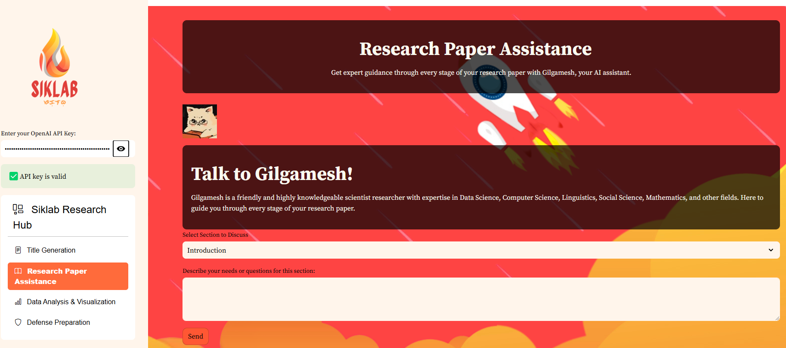
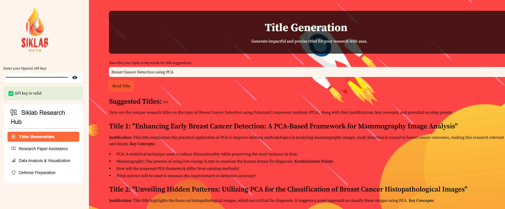
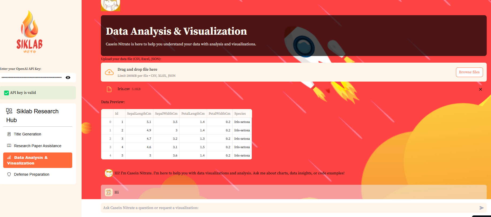
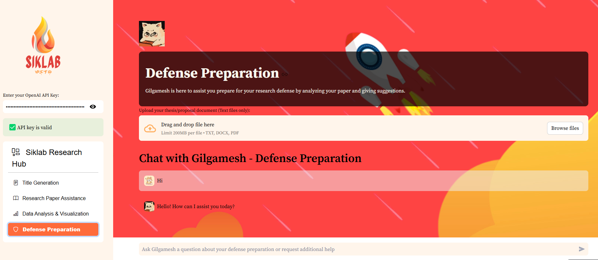

# Siklab: A Research Assistant Hub

Welcome to **Siklab**—your comprehensive research hub designed to assist students, researchers, and academics at every stage of their research journey. Siklab provides tools for title generation, research paper assistance, data analysis, and defense preparation, all in one seamless, user-friendly interface.

---

## Table of Contents

- [Features](#features)
- [Project Structure](#project-structure)
- [Technology](#technology)
- [Getting Started](#getting-started)
- [API Key Configuration](#api-key-configuration)
- [Running the App](#running-the-app)

---

## Features

### 📋 Title Generation
Generate impactful and precise titles for your research. Siklab’s title generator uses advanced AI to provide unique, justified title suggestions based on your topic keywords.

### 📑 Research Paper Assistance
Need guidance on your research paper? Siklab’s Research Paper Assistant is here to help, offering advice on structure, citations, and ensuring clarity in your arguments.

### 📊 Data Analysis & Visualization
Upload datasets and receive insightful data visualizations. Siklab suggests the best charts based on data characteristics and provides interpretations, making complex data more accessible and understandable.

### 🛡️ Defense Preparation
Prepare confidently for your research defense! Siklab offers in-depth feedback on your document, including potential questions, critique points, and areas of improvement.

## Interface Previews

### Research Paper Assistance


### Title Generation


### Data Analysis & Visualization


### Defense Preparation


---

## Project Structure

Here’s an overview of the Siklab project structure:
```
Siklab/
│
├── images/                          # Images used in the app (e.g., logos, avatars)
│   ├── Siklab.png                   # Siklab logo
│   ├── Gilgamesh.jpg                # Avatar for Research Paper Assistance
│   └── Casein_Nitrate.jpg           # Avatar for Data Analysis & Visualization
│
├── app.py                           # Main application file with navigation and layout
├── title_generator.py               # Title generation module
├── research_assistant.py            # Research paper assistance module
├── data_analysis.py                 # Data analysis and visualization module
├── defense_preparation.py           # Defense preparation module
├── requirements.txt                 # Required dependencies for the project
└── README.md                        # Project documentation (this file)
```

---

## Technology

**Siklab** is built using the following technologies:

- **Streamlit**: For creating an interactive and user-friendly web interface.
- **OpenAI API**: Powers the assistant capabilities, including title generation, research feedback, and general assistance.
- **Python Libraries**:
  - **Pandas** and **NumPy**: For data handling and analysis.
  - **Matplotlib** and **Seaborn**: For data visualization.
  - **PyPDF2** and **python-docx**: For handling and processing uploaded files (PDF and DOCX).

---

## Getting Started

To set up Siklab locally, follow these steps:

1. **Clone the Repository**:
   ```bash
   git clone https://github.com/your-username/Siklab.git
   cd Siklab
    ```
2. Install Required Dependencies: Make sure you have Python installed. Then, install all necessary dependencies using:
   ```bash
   pip install -r requirements.txt
    ```
3. API Key Configuration: Siklab requires an OpenAI API key for generating responses. Follow the instructions below to configure your API key.

## API Key Configuration
To use Siklab, you need to provide an OpenAI API key. You can obtain one by signing up at OpenAI.

** Set up Environment Variables ** 
For security, it’s recommended to set up your API key as an environment variable. In your terminal, enter:
  ```bash
  export OPENAI_API_KEY='your-api-key'
  ```
** Alternatively, Input Key in the App **
If you prefer, you can input your OpenAI API key directly in the Siklab app sidebar.

## Running the App
Once you’ve set up the API key and installed dependencies, you can run the application with the following command:
  ```bash
  streamlit run app.py
  ```

